# eCommerce: LJA E-Store

**Developer: Lanre James Andero**

💻 [Visit live website](https://lja-estore-b0397d447086.herokuapp.com/)  
(Ctrl + click to open in new tab)

## Table of Contents
  - [Executive Summary](#executive-summary)
     - [Market Analysis](#market-analysis)
     - [Marketing and Sales Strategy](#marketing-and-sales-strategy)
     - [Operations and Management](#operations-and-management)
     - [Financial Plan](#financial-plan)
     - [Conclusion](#conclusion)
  - [Marketing](#marketing)
     - [Social Media](#social-media)
     - [Mailing List](#mailing-list)
  - [User Goals](#user-goals)
  - [Site Owner Goals](#site-owner-goals)
  - [User Experience](#user-experience)
  - [User Stories](#user-stories)
  - [Design](#design)
    - [Fonts](#fonts)
    - [Structure](#structure)
      - [Website pages](#website-pages)
      - [AWS](#aws)
      - [Database](#database)
      - [Models](#models)
  - [Technologies Used](#technologies-used)
  - [Features](#features)
  - [Validation](#validation)
  - [Testing](#testing)
    - [Manual testing](#manual-testing)
    - [Automated testing](#automated-testing)
    - [Tests on various devices](#tests-on-various-devices)
    - [Browser compatibility](#browser-compatibility)
  - [Bugs](#bugs)
  - [Deployment](#deployment)
  - [Credits](#credits)
  - [Acknowledgements](#acknowledgements)

## Business Plan  
### Executive Summary:

LJA E-Store is a leading web-based platform specializing in mobile phones and accessories sales. With a user-friendly interface, seamless shopping experience, and a wide range of products, LJA E-Store aims to become the go-to destination for mobile enthusiasts. Our platform offers not only product sales but also valuable insights, reviews, and customer support to enhance the overall shopping experience. Targeting tech-savvy consumers and organizations seeking quality mobile solutions, LJA E-Store endeavors to establish itself as a trusted brand in the mobile industry.

### Market Analysis:

The mobile phone and accessories market is robust, with a growing consumer base and increasing demand for innovative products. With the proliferation of smartphones and mobile technology, there is a significant opportunity for LJA E-Store to capitalize on this trend. Despite competition from established e-commerce platforms and brick-and-mortar stores, LJA E-Store's specialization in mobile products, coupled with its user-centric approach, sets it apart in the market. Targeting mobile enthusiasts of all demographics and organizations seeking reliable mobile solutions, LJA E-Store aims to capture a significant market share.

### Marketing and Sales Strategy:

LJA E-Store will employ a comprehensive marketing strategy encompassing online advertising, content marketing, partnerships, sponsorships, and customer engagement initiatives. Leveraging digital channels such as social media, search engine marketing, and email marketing, LJA E-Store will engage with its target audience effectively. Furthermore, strategic partnerships with mobile brands and influencer collaborations will enhance brand visibility and credibility. Sales efforts will focus on providing personalized recommendations, competitive pricing, and exceptional customer service to drive conversions.

### Operations and Management:

Operated by a skilled team comprising executives, developers, and marketing/sales professionals, LJA E-Store will ensure efficient operations and strategic management. Utilizing cutting-edge technology for website infrastructure and logistics management, along with robust customer relationship management systems, LJA E-Store will optimize efficiency and scalability.

#### Financial Plan:

LJA E-Store anticipates revenue generation through product sales in its e-commerce shop, supplemented by strategic marketing investments. Initial funding will be sourced through personal investment and seed funding rounds, with potential avenues for further financing as the business expands. Revenue projections indicate substantial growth over the initial years, with profitability expected within the second year of operation.

### Conclusion:

With its specialized offerings, customer-centric approach, and strong growth projections, LJA E-Store is poised to become a leader in the mobile industry. By delivering exceptional value and service to its customers, LJA E-Store aims to carve a niche as the premier destination for mobile phones and accessories.

##### Back to [top](#table-of-contents)

## Marketing  

### Social Media  
LJA E-Store maintains an active presence on social media platforms such as Facebook and Instagram, serving as key channels for engaging with its audience. The Facebook page serves as a hub for promotional activities, product launches, and customer testimonials. On Instagram and Twitter, LJA E-Store showcases its latest products, offers exclusive deals, and interacts with followers to build brand loyalty. These social media channels play a vital role in driving brand awareness, customer engagement, and sales growth for LJA E-Store in the competitive mobile market.

[Facebook](https://www.facebook.com/profile.php?id=121104481304395)  
[Instagram](https://www.instagram.com/ljaestorepp5/)

### Mailing List  

LJA E-Store uses Mailchimp to manage its mailing list. By joining the mailing list, users will receive updates on new features, upcoming events, and exclusive promotions. The process to join the mailing list is simple, users just need to provide their email address on the website, and they will start receiving email updates. Mailchimp allows the "LJA E-Store" team to segment the mailing list, personalize emails and track the success of email campaigns. By joining the mailing list, users will stay informed and be the first to know about new developments in the "LJA E-Store" web app.  

See Image

  

 

## User Goals

- Find desired mobile phone products quickly and effortlessly by utilizing intuitive navigation features and user-friendly interface within the ecommerce shop.
- Explore a diverse selection of mobile phone-related products, including smartphones, cases, chargers, headphones, and more, to fulfill specific needs and preferences.
- Enjoy a seamless shopping experience, from browsing products to completing transactions securely and efficiently, within the ecommerce shop.
- Easily access relevant information, such as product details, pricing, and availability, to make informed purchasing decisions and comparisons.
- Receive prompt and helpful assistance from the LJA E-Store team by utilizing the contact page for inquiries, support needs, or feedback regarding products or services.
- Stay informed about promotions, discounts, and new product releases through notifications or newsletters, enhancing the overall shopping experience.
- Track orders and shipments effortlessly, with transparent and real-time updates provided by the ecommerce platform, ensuring peace of mind throughout the purchasing process.
- Benefit from flexible payment options and secure transaction processes, guaranteeing a safe and reliable shopping experience for users.

## Site Owner Goals

- Maximize profitability by optimizing sales strategies, including upselling, cross-selling, and promotional campaigns within the ecommerce shop.
- Continuously improve customer satisfaction by offering excellent customer service, hassle-free returns, and prompt resolution of any issues or inquiries.
- Enhance brand visibility and credibility through strategic marketing efforts, including social media engagement, influencer partnerships, and targeted advertising.
- Expand product offerings to cater to evolving consumer preferences and trends, ensuring a diverse and comprehensive selection of mobile phones and accessories.
- Implement data-driven decision-making processes to analyze customer behavior, identify opportunities for growth, and enhance the overall shopping experience.
- Foster partnerships with mobile phone manufacturers and suppliers to secure competitive pricing, exclusive deals, and access to new product releases.
- Invest in technological advancements and infrastructure to ensure a seamless and secure online shopping experience, including mobile optimization and robust cybersecurity measures.
- Cultivate a community of brand advocates through loyalty programs, referral incentives, and engaging content to foster repeat purchases and word-of-mouth marketing.

## User Experience

### Target Audience
- Mobile phone enthusiasts who are seeking the latest smartphones and accessories for their devices.
- Tech-savvy individuals interested in exploring a wide range of mobile phone brands and accessories conveniently through an ecommerce platform.
- Smartphone users looking for reliable and affordable options for cases, chargers, screen protectors, and other accessories tailored to their specific device model.
- Individuals who prioritize convenience and efficiency in purchasing mobile phones and accessories online, benefiting from a user-friendly interface and seamless shopping experience.
- Small businesses or organizations in need of bulk purchases of mobile phones and accessories for their employees or promotional purposes.
- Those seeking expert advice and insights on mobile phone trends, comparisons, and recommendations, provided through informative blog posts and guides within the e-store.
- Any individual interested in exploring the latest mobile phone technology and enhancing their smartphone experience through quality accessories.

### User Requirements and Expectations

- A user-friendly interface: Users will expect the app to be easy to navigate and use, with clear and concise instructions for purchasing products.
- Reliability: Users will expect the app to be reliable and function smoothly, without any errors or technical issues.
- Security: Users will expect their personal and financial information to be secure when using the app, and will expect the app to have appropriate measures in place to protect their data.
- Accurate and up-to-date information: Users will expect the app to provide accurate and up-to-date information about products.
- Competitive prices: Users will expect the prices for products to be competitive with other options available on the market.
- Good customer service: Users will expect the app to have good customer service, including responsive and helpful support in the event of any issues or questions.
- Accessibility

##### Back to [top](#table-of-contents)

## User Stories

| User Story ID                  | As A/AN             | I CAN...                                                | SO THAT I CAN...                                          |
|--------------------------------|---------------------|---------------------------------------------------------|-----------------------------------------------------------|
| Registration and User Accounts ||||
| 1 | Shopper / Site User | register for an account | have an account and view my profile |
| 2 | Shopper / Site User | login and logout | have an account with my information stored for fast usage |
| 3 | Shopper / Site User | recover my password | set a new password if I forgot it                         |
| 4 | Shopper / Site User | receive an email confirmation after registration| be notified registration was successful                   |
| Viewing and navigation ||||
| 5| Shopper / Site User | navigate across the site | can access all parts of the site                          |
| 6 | Shopper / Site User | use a navbar, footer, and social icons | navigate the site, access menus, and access socials       |
| 7 | Shopper / Site User | be notified of my actions | be aware the action was completed successfully or not     |
| 8 | Shopper / Site User | see my login status | know if I am logged in or not |
| 9 | Shopper / Site User | visit the shop| view all products available |
| 10 | Shopper / Site User | view my bag and total cost at any time | so I am aware of what I am buying and it's cost |
| 11 | Shopper / Site User | view a list of products | select a product to purchase                              |
| 12 | Shopper / Site User | view an individual product details | view a more detailed view of the product |
| 13 | Shopper / Site User | have a profile | store my information for faster checkouts in the future |
| Sorting and Searching ||||
| 14 | Shopper / Site User | search for a product by name or description | find a certain product                                    |
| 15 | Shopper / Site User | see my search results | only see what I am searching for |
| 16 | Shopper / Site User | sort by category | select products of a certain category |
| 17 | Shopper / Site User | sort by price low to high and high to low | view products according to my budget |
| Purchasing and Checkout ||||
| 18 | Shopper / Site User | use a card as the payment method | complete my purchase                                      |
| 19 | Shopper / Site User | select the quantity of a product | select the quantity to my needs |
| 20 | Shopper / Site User | view items in my bag | be aware of what I am buying and it's cost |
| 21 | Shopper / Site User | adjust item quantity in my bag | increase or reduce item count according to my needs |
| 22 | Shopper / Site User | receive order confirmation | be notified of a successful order |
| 23 | Shopper / Site User | receive email confirmation | have a record of my purchase |
| Admin and Store Management | | | |
| 24 | Store Owner / Admin | add a product | add new products to the shop |
| 25 | Store Owner / Admin | edit a product | edit existing products in the shop |
| 26 | Store Owner / Admin | delete a product | delete existing products from the shop |

### Kanban, Epics & User Stories
- GitHub Kanban was used to track all open user stories
- Backlog, In Progress, Done headings were used in the kanban

User Stories

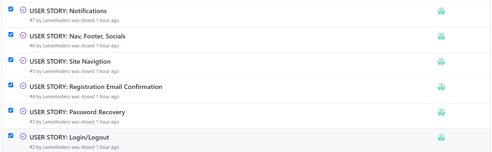
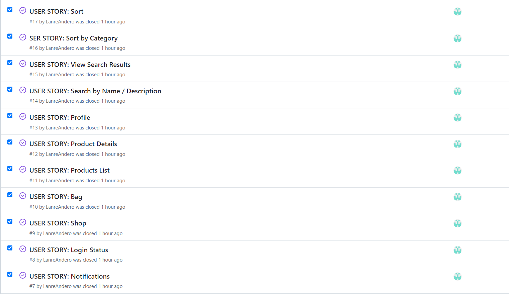
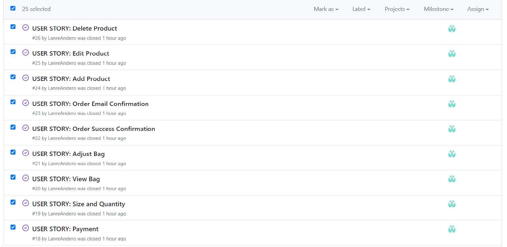

Kanban

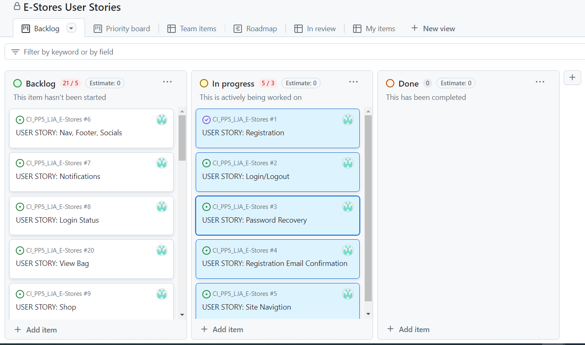

##### Back to [top](#table-of-contents)

## Design

### Fonts

 The font selected was from Google Fonts, Lato.

 

See Font Image

# Structure

The site was designed for the user to be familiar with the layout such as a navigation bar along the top of the pages and a hamburger menu button for smaller screen.

The footer contains all relevant social media links that the business has so the user can visit any social media site and follow the business there to expand the businesses followers, likes and shares.
It contains an email sign up form and useful links as well as contact information.

## Website pages

- The site consists of the following pages:
  - Home
  - About
  - Product List
  - Product Expanded
  - Bag
  - Checkout
  - Checkout Success
  - Contact
  - Register
  - Profile
  - Login
  - Logout
  - Reset Password
  - Register
  - 404

##### Back to [top](#table-of-contents)

## AWS 

I am using AWS S3 buckets to store my data. S3 is a highly scalable and durable cloud storage service provided by Amazon Web Services. It allows me to easily store and retrieve large amounts of data, and its built-in security features provide added protection for my files. I chose S3 for its scalability, durability, and security features.

See AWS Images

## Database

I built my database using PostgreSQL. It's a powerful and open-source object-relational database system that is known for its reliability, robustness, and performance. I chose it because it provides a flexible tool for efficiently managing and organizing my data.

See Database Image

## Models  

### User Model

| Key        | Name         | Type        |
| ---------- | ------------ | ----------- |
| PrimaryKey | user_id      | AutoField   |
|            | password     | VARCHAR(45) |
|            | last_login   | VARCHAR(45) |
|            | is_superuser | BOOLEAN     |
|            | username     | VARCHAR(45) |
|            | first_name   | VARCHAR(45) |
|            | last_name    | VARCHAR(45) |
|            | email        | VARCHAR(45) |
|            | is_staff     | BOOLEAN     |
|            | is_active    | BOOLEAN     |
|            | date_joined  | VARCHAR(45) |

### User Profile Model

| Key        | Name                 | Type          |
| ---------- | -------------------- | ------------- |
| PrimaryKey | user_profile_id      | AutoField     |
| ForeignKey | user                 | User model    |
|            | default_phone_number | CharField[20] |
|            | default_address1     | CharField[80] |
|            | default_address2     | CharField[80] |
|            | default_town_city    | CharField[40] |
|            | default_county       | CharField[80] |
|            | default_postcode     | CharField[20] |
|            | default_country      | CharField[40] |

### Product Model

| Key        | Name        | Type           |
| ---------- | ----------- | -------------- |
| PrimaryKey | brand       | CharField[50]  |
|            | name        | CharField[50]  |
|            | description | TextField      |
|            | price       | DecimalField   |
| ForeignKey | category    | Category model |
|            | rating      | DecimalField   |
|            | image       | ImageField     |

### Category Model  

| Key        | Name          | Type      |
| ---------- | ------------- | --------- |
| PrimaryKey | category_id   | AutoField |
|            | name          | Char[254] |
|            | friendly_name | Char[254] |

### Order Model  

| Key        | Name            | Type               |
| ---------- | --------------- | ------------------ |
| PrimaryKey | order_id        | AutoField          |
|            | order_number    | CharField[40]      |
| ForeignKey | user_profile    | User profile Model |
|            | full_name       | CharField[50]      |
|            | email           | EmailField[254]    |
|            | phone_number    | CharField[20]      |
|            | address1        | CharField[80]      |
|            | address2        | CharField[80]      |
|            | town_city       | CharField[40]      |
|            | postcode        | CharField[20]      |
|            | county          | CharField[80]      |
|            | country         | CharField[40]      |
|            | date            | DateTimeField      |
|            | delivery_cost   | DecimalField[6]    |
|            | order_total     | DecimalField[10]   |
|            | grand_total     | DecimalField[10]   |
|            | original_bag    | TextField          |
|            | stripe_pid      | CharField          |

### OrderLineItem Model  

| Key        | Name             | Type            |
| ---------- | ---------------- | --------------- |
| PrimaryKey | OrderLineItem_id | AutoField       |
| ForeignKey | order            | Order Model     |
| ForeignKey | product          | Product Model   |
|            | quantity         | IntegerField    |
|            | line_item_total  | DecimalField[6] |

### ContactUs Model

| Key        | Name         | Type             |
| ---------- | ------------ | ---------------- |
| PrimaryKey | message_id   | AutoField        |
|            | created_date | DateTimeField    |
| ForeignKey | user         | User model       |
|            | name         | CharField        |
|            | email        | EmailField       |
|            | phone        | PhoneNumberField |
|            | body         | TextField        |  

##### Back to [top](#table-of-contents)

## Technologies Used

### Languages & Frameworks

- HTML
- CSS
- Javascript
- Python
- Django

### Libraries & Tools

- [Am I Responsive](http://ami.responsivedesign.is/)
- [Bootstrap v4](https://getbootstrap.com/)
- [Favicon.io](https://favicon.io)
- [Chrome dev tools](https://developers.google.com/web/tools/chrome-devtools/)
- [Font Awesome](https://fontawesome.com/)
- [Gitpod](https://gitpod.io/)
- [GitHub](https://github.com/)
- [Google Fonts](https://fonts.google.com/)
- [Heroku Platform](https://id.heroku.com/login)
- [AWS](https://aws.amazon.com/)
- [jQuery](https://jquery.com)
- [Postgres](https://www.elephantsql.com/)
- [Summernote](https://summernote.org/)
- Validation:
  - [WC3 Validator](https://validator.w3.org/)
  - [Jigsaw W3 Validator](https://jigsaw.w3.org/css-validator/)
  - [JShint](https://jshint.com/)
  - [CI Python Liner(PEP8)](https://pep8ci.herokuapp.com/)
  - [Lighthouse](https://developers.google.com/web/tools/lighthouse/)
  - [Flake8](https://flake8.pycqa.org/)

##### Back to [top](#table-of-contents)

## Features

### Search Engine Optimisation (SEO)
I have used meta tags in the HTML of my web app's pages to optimize them for search engines. The description tag provides a brief summary of the content on the page, while the keywords tag lists relevant keywords to help search engines understand the content of the webpage and its relevance to related search queries.

See feature image

  

### Home page
- Home page includes nav bar, main body and a footer.

See feature images

  

### Logo
- A custom logo for the business.
- User stories covered: 6, 7

See feature images

  

### Navigation
- Fully Responsive.
- On small screens switches to hamburger menu.
- Indicates login/logout in status.
- displayed on all pages.  
- User stories covered: 6, 7

See feature images

### Footer
- Contains social media links, privacy policy, and copyright.
- displayed across all pages.  
- User stories covered: 6, 7

See feature images

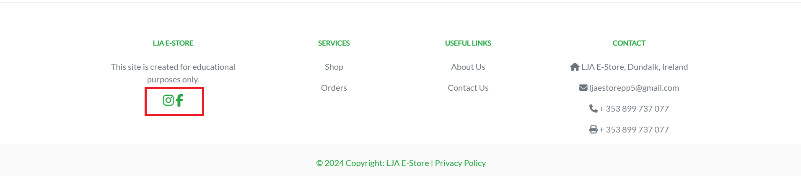

  

### Mailing List Sign Up
- Mailchimp signup for email mailing list.  

See feature images

### Sign up / Register
- Allow users to register an acoount.
- User stories covered: 1  

See feature image

### Sign In
- User can sign in.  
- User stories covered: 2

See feature images

### Sign Out
- Allows the user to securely sign out.
- Ask user if they are sure they want to sign out.  
- User stories covered: 2

See feature image

### Alert Box
- Allows the user to see relevant alerts.  

See feature image

### Shop
- Allows the user to view the listed products in the shop.  
- User stories covered: 9

See feature image

  

### Sort
- Allows the user to sort the listed products.  
- User stories covered: 16, 17

See feature images

  

### Product Detail
- Allows the user to view the products details.  
- User stories covered: 12

See feature image

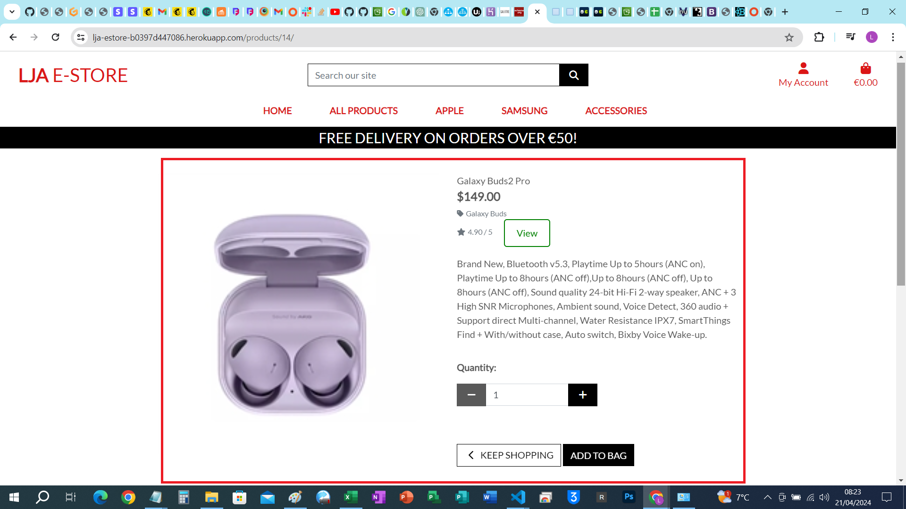

  

### Search
- Allows the user to search for products.  
- User stories covered: 14

See feature image

  

### Bag
- Allows the user to view the bag with their items.
- Pops up as items are added and removed.
- User stories covered: 10  

See feature image

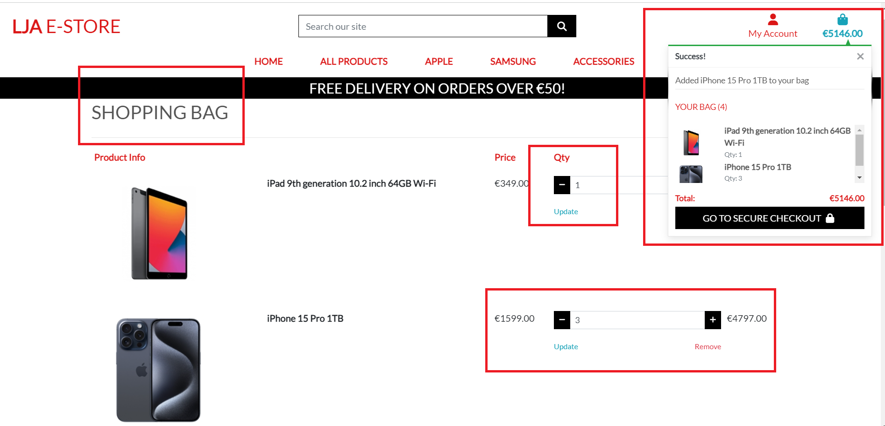

  

### Checkout
- Allows the user to purchase items in their bag.  
- User stories covered: 18

See feature image

  

### Stripe
- Allows the user to use stripe for card payments.  
- User stories covered: 18

See feature image

### Latest Deals Alert
- Allows the user to see deal offer alert once a an order has been completed.  

See feature image

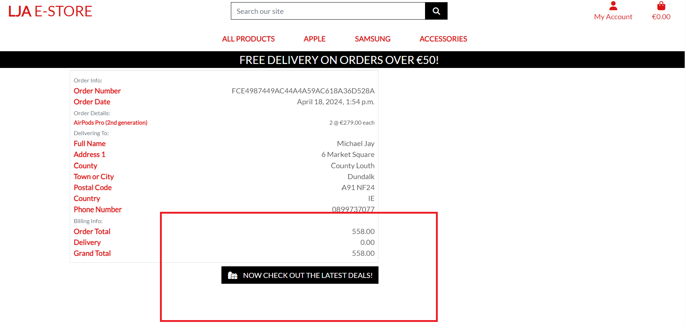

### Email Confirmation
- Allows the user to receive an email confirmation for their registeration.
- Allows the user to receive an email confirmation for their order.  
- User stories covered: 4 and 23

See feature image

  

### Profile
- Allows the user to update their information and see their order history.  
- User stories covered: 13

See feature image

  

### Add Product
- Allows the Admin to add new products.  
- User stories covered: 24

See feature image

  

### Edit Product
- Allows the Admin to edit the products.  
- User stories covered: 25

See feature image

  

### Delete Product
- Allows the Admin to delete products.  
- User stories covered: 26

See feature image

  

### Contact Us / Send Message
- A contact page with all contact details listed
- Users can send a message via the message form  
  

See feature images

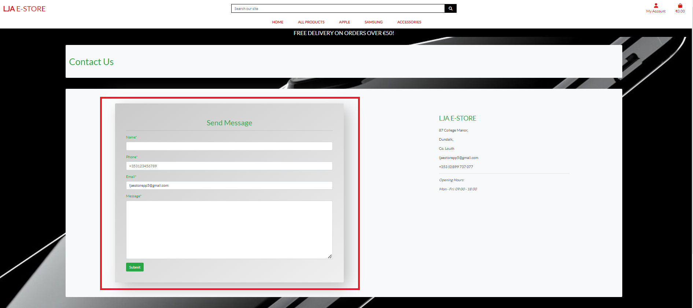

### Social Media Links
- A logo and link is used for the Facebook business page and Instagram page.
- All links open in a new tab to ensure the user is not directed away from the business.
- noopener, noreferrer, nofollow used to communicate with web crawlers and for security and privacy concerns.  
- User stories covered: 6
  

See feature image

##### Back to [top](#table-of-contents)

# Validation  

### CSS Validation
The W3C Jigsaw CSS Validation Service was used to validate the CSS of the website.

base.css

 

profile.css

  

checkout.css

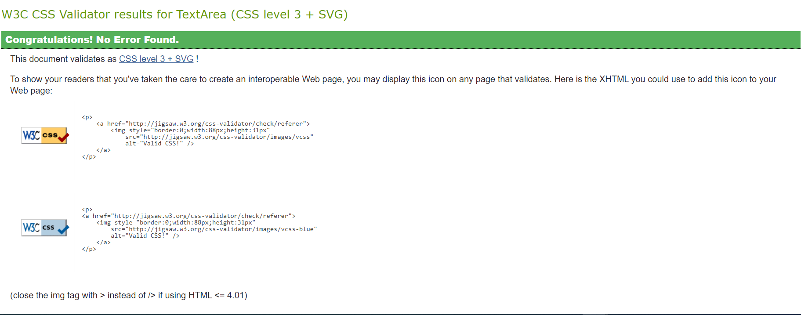

### JavaScript Validation
JSHint javaScript Validation Service was used to validate all javaScript files.

stripe_elements.js
  

  

- two undefined variable Stripe which originates from a external script

category.js

  

product.js

country_field.js

- No issues raised  

##### Back to [top](#table-of-contents)
  

## PEP8 Validation
[CI Python Linter](https://pep8ci.herokuapp.com/) was used to check the code for PEP8 requirements.

About

apps.py

urls.py

views.py

Bag

bag_tools.py

contexts.py

urls.py

views.py

checkout

admin.py

apps.py

forms.py

  

models.py

signals.py

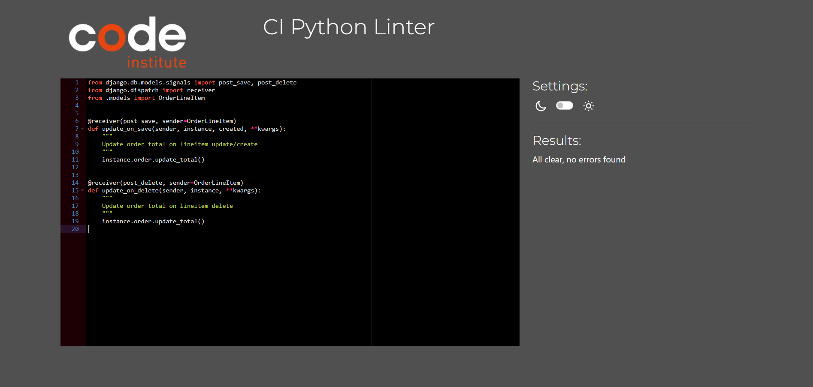

urls.py

views.py

  

webhook_handler.py

  

webhook.py

  

contact

admin.py

forms.py

models.py

urls.py

views.py

e_store

asgi.py

settings.py

urls.py

views.py

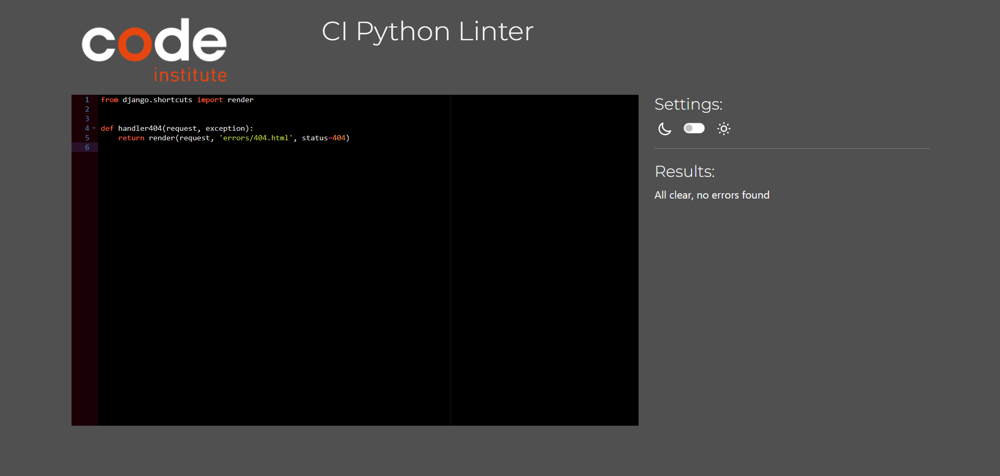

  

wsgi.py

home

apps.py

urls.py

views.py

products

admin.py

apps.py

forms.py

models.py

sitemaps.py

urls.py

views.py

  

widgets.py

profiles

apps.py

forms.py

models.py

urls.py

views.py

  

root

custom_storages.py

manage.py

##### Back to [top](#table-of-contents)
  

## Lighthouse

Performance, best practices and SEO was tested using Lighthouse.

#### Desktop

Home

Sign Up

Sign In

Sign Out

Product List

Product Expand

  

Add Product

  

Edit Product

  

Bag

  

Checkout

  

Checkout Success

  

Contact

  

Profile

Search

404

##### Back to [top](#table-of-contents)

## Testing

1. Manual testing User Stories
2. Automated testing

### Manual testing

1.	As A/AN Shopper / Site User	I CAN register for an account	SO THAT I CAN have an account and view my profile  

| Feature | Action | Expected Result | Actual Result |
| ------- | ------ | --------------- | ------------- |
| Sign Up | Click pofile button and select register, user is brought to the sign up page| User is brought to the sign up page | Works as expected 

See Images

  

2.	As A/AN Shopper / Site User	I CAN login and logout SO THAT I CAN have an account with my information stored for fast usage  

| Feature | Action | Expected Result | Actual Result |
| ------- | ------ | --------------- | ------------- |
| Sign In | Click pofile button and select login, user is brought to the sign in page | User is brought to the sign in page | Works as expected  

See Images

  

3.	As A/AN Shopper / Site User	I CAN recover my password	SO THAT I CAN set a new password if I forgot it  

| Feature | Action | Expected Result | Actual Result |
| ------- | ------ | --------------- | ------------- |
| Reset Password | Click pofile button and select login, user is brought to the sign in page, click forgot password to go to password reset page | User is brought to password reset page | Works as expected  

See Images

  

4.	As A/AN Shopper / Site User	I CAN receive an email confirmation after registration	SO THAT I CAN be notified registration was successful  

| Feature | Action | Expected Result | Actual Result |
| ------- | ------ | --------------- | ------------- |
| Registration | Upon registration an email is sent to verify the email address submitted | Registration email arrives into inbox of the email address used to sign up | Works as expected  

See Images

  

5.	As A/AN Shopper / Site User	I CAN navigate across the site 	SO THAT I CAN can access all parts of the site  

| Feature | Action | Expected Result | Actual Result |
| ------- | ------ | --------------- | ------------- |
| Navbar | Click on any link in the navbar to be brought to a relevant page, shop for example | Be brought to shop to view all products after clicking all products in the navbar | Works as expected  

See Images

  

6.	As A/AN Shopper / Site User	I CAN use a navbar, footer, and social icons  SO THAT I CAN navigate the site, access menus, and access socials  

| Feature | Action | Expected Result | Actual Result |
| ------- | ------ | --------------- | ------------- |
| Navbar/Footer | Scoll to footer, click on the Instagram logo | A new tab will open and bring user to the LJA E-Store Instagram page | Works as expected  

See Images

  

7.	As A/AN Shopper / Site User	I CAN be notified of my actions	SO THAT I CAN be aware the action was completed successfully or not  

| Feature | Action | Expected Result | Actual Result |
| ------- | ------ | --------------- | ------------- |
| Alert Box | Add an item from the shop to the bag | A message will appear in the alert box on screen to notify the user of this action | Works as expected  

See Images

  

8.	As A/AN Shopper / Site User	I CAN see my login status	SO THAT I CAN know if I am logged in or not  

| Feature | Action | Expected Result | Actual Result |
| ------- | ------ | --------------- | ------------- |
| Navigation | While logged out user get a sign out success message | Once logged in get a signed in success message | Works as expected  

See Images

  

9.	As A/AN Shopper / Site User	I CAN visit the shop SO THAT I CAN view all products available  

| Feature | Action | Expected Result | Actual Result |
| ------- | ------ | --------------- | ------------- |
| Shop | Click shop in the navbar, select all products | User is then brought to the all products page of the shop | Works as expected  

See Images

  

10.	As A/AN Shopper / Site User	I CAN view my bag and total cost at any time	so I am aware of what I am buying and it's cost  

| Feature | Action | Expected Result | Actual Result |
| ------- | ------ | --------------- | ------------- |
| Bag | Click the bag icon in the navbar | User is brought to the bag page where all products in bag are displayed along with their price and total cost | Works as expected  

See Images

  

11.	As A/AN Shopper / Site User	I CAN view a list of products	SO THAT I CAN select a product to purchase  

| Feature | Action | Expected Result | Actual Result |
| ------- | ------ | --------------- | ------------- |
| Categories | Select all products, select a category | User is brought to the selected category of product and all products are listed | Works as expected  

See Images

  

12.	As A/AN Shopper / Site User	I CAN view an individual product details SO THAT I CAN view a more detailed view of the product  

| Feature | Action | Expected Result | Actual Result |
| ------- | ------ | --------------- | ------------- |
| Product Detail | Click on any item image in the shop, or the view button     |  User is borught to the product detail page where product details are displayed | Works as expected  

See Images

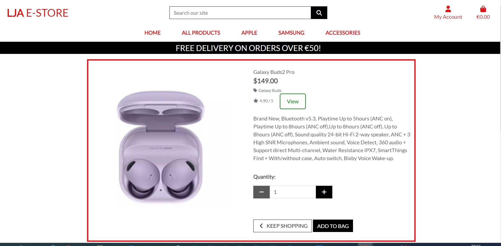

 

13.	As A/AN Shopper / Site User	I CAN have a profile SO THAT I CAN store my information for faster checkouts in the future  

| Feature | Action | Expected Result | Actual Result |
| ------- | ------ | --------------- | ------------- |
| Profile | From the Nav click the profile icon, select profile from dropdown and be brought to the profile page where user information is stored | Be brought to profile page | Works as expected  

See Images

  

14.	As A/AN Shopper / Site User	I CAN search for a product by name or description	SO THAT I CAN find a certain product 
 
| Feature | Action | Expected Result | Actual Result |
| ------- | ------ | --------------- | ------------- |
| Search | Search box in the navigation bar, input keyword to search such as "galaxy", click search | All items with the relevant keyword will be displayed | Works as expected  

See Images

  

15.	As A/AN Shopper / Site User	I CAN see my search results	SO THAT I CAN only see what I am searching for  

| Feature | Action | Expected Result | Actual Result |
| ------- | ------ | --------------- | ------------- |
| Search | Input a keyword into the search box in the navbar and click search | All items matching the search critearia are only displayed | Works as expected  

See Images

  

16.	As A/AN Shopper / Site User	I CAN sort by category SO THAT I CAN select products of a certain category  

| Feature | Action | Expected Result | Actual Result |
| ------- | ------ | --------------- | ------------- |
| Sort | From the shop page, click Apple in the navbar, select a category such as iPad | User is brought to the iPad page where only products classed as iPad are displayed | Works as expected

See Images

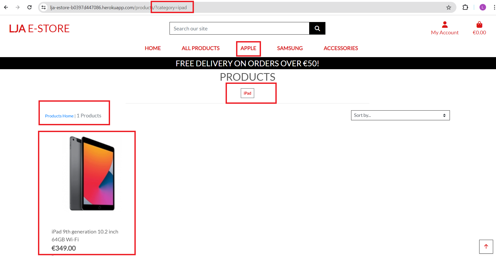

  

17.	As A/AN Shopper / Site User	I CAN sort by price low to high and high to low	SO THAT I CAN view products according to my budget 
 
| Feature | Action | Expected Result | Actual Result |
| ------- | ------ | --------------- | ------------- |
| Sort | From the shop page, click the sort box and select price from high to low | All items will be sorted from the highest price to the lowest price | Works as expected  

See Images

  

18.	As A/AN Shopper / Site User	I CAN use a card as the payment method SO THAT I CAN complete my purchase  

| Feature | Action | Expected Result | Actual Result |
| ------- | ------ | --------------- | ------------- |
| Checkout | From the bag select secure checkout | Input user information, input card number 4242 4242 4242 4242 04/24 424 24242, payment is successful | Works as expected  

See Images

  

19.	As A/AN Shopper / Site User	I CAN select the quantity of a product	SO THAT I CAN select the quantity to my needs  

| Feature | Action | Expected Result | Actual Result |
| ------- | ------ | --------------- | ------------- |
| Product Details | From Product details page select + or - to increase or decrease quantity from the quantity box | the quantity will be adjusted | Works as expected  

See Images

  

20.	As A/AN Shopper / Site User	I CAN view items in my bag	SO THAT I CAN be aware of what I am buying and it's cost  

| Feature | Action | Expected Result | Actual Result |
| ------- | ------ | --------------- | ------------- |
| Bag | Click the bag icon in the navbar | The bag page will appear and display all items in the bag and their cost alongside total price for all items | Works as expected  

See Images

  

21.	As A/AN Shopper / Site User	I CAN adjust item quantity in my bag	SO THAT I CAN increase or reduce item count according to my needs  

| Feature | Action | Expected Result | Actual Result |
| ------- | ------ | --------------- | ------------- |
| Bag | From the bag press the increase/ decrease button to desired number, click update | The bag will update with the desired quantity | Works as expected  

See Images

  

22.	As A/AN Shopper / Site User	I CAN receive order confirmation SO THAT I CAN be notified of a successful order  

| Feature | Action | Expected Result | Actual Result |
| ------- | ------ | --------------- | ------------- |
| Alert Box | Upon a successful checkout an alert box will be visible to the user | Alert box pops up with the order details | Works as expected  

See Images

  

23.	As A/AN Shopper / Site User	I CAN receive email confirmation SO THAT I CAN have a record of my purchased.

| Feature | Action | Expected Result | Actual Result |
| ------- | ------ | --------------- | ------------- |
| Email Confirmation | Upon a successful checkout a confirmation email will be sent to the provided email address which contains the details of the order |     Email confirmation arrives into inbox | Works as expected  

See Images

  

24.	As A/AN Store Owner / Admin	I CAN add a product SO THAT I CAN add new products to the shop  

| Feature | Action | Expected Result | Actual Result |
| ------- | ------ | --------------- | ------------- |
| Add Product | From the navbar select the profile button as an admin logged in, click add product from the dropdown | The add product page will appear allowing the addition of a new product via the add product form | Works as expected  

See Images

  

25.	As A/AN Store Owner / Admin	I CAN edit a product SO THAT I CAN edit existing products in the shop  

| Feature | Action | Expected Result | Actual Result |
| ------- | ------ | --------------- | ------------- |
| Edit Product | From product detail as an admin account, find a edit button on the page, click edit | Admin is brought to the edit product page where they can adjust any part of the product | Works as expected  

See Images

  

26.	As A/AN Store Owner / Admin	I CAN delete a product SO THAT I CAN delete existing products from the shop  

| Feature | Action | Expected Result | Actual Result |
| ------- | ------ | --------------- | ------------- |
| Delete Product  | From product detail as an admin account, find a delete button on the page, click delete | A modal pops up and asks the admin to confirm they wish to delete the product | Works as expected |  

See Images

  

### Automated testing

- No Automated testing ws done in this project

### Device Testing & Browser compatibility

The site uses to test on various real world devices was [BrowserStack](https://www.browserstack.com/)  

This allowed me to test on real devices and not just device emulators.

The following devices were used to test my site:

Apple iPhone 15

Apple iPad Pro 2022

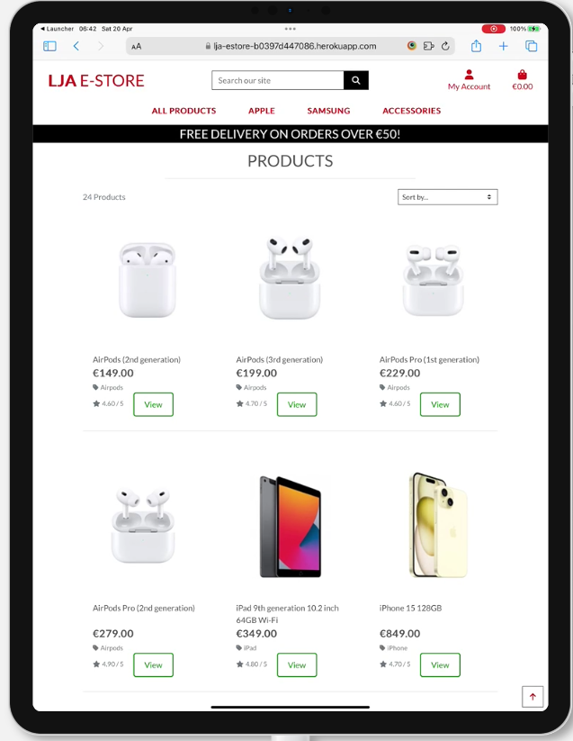

Google Pixel 8 Pro

Samsung Galaxy S23

Samsung Galaxy Tab9

Xiaomi-Redmi-Note-12-Pro

Mozilla Firefox (v123 latest)

Google Chrome (v123 latest)

Safari (5.1 latest)

Microsoft Edge (v123)

Opera (v109)

##### Back to [top](#table-of-contents)

## Bugs

| **Bug** | **Fix** |
| ------- | ------- |
| Increment and decrement product quantity in bag not working | Increment and decrement buttons being linked to jQuery script solved this |
| Webhooks not working | Endpoint was not fully configured, adding the correct settings resolved this |

##### Back to [top](#table-of-contents)

## Deployment  
### AWS S3 Bucket Setup  

To set up an AWS S3 bucket:

1. Sign in to the AWS Management Console and open the Amazon S3 console.  

See Images

2. Click on the "Create Bucket" button.  

See Images

3. Enter a unique name for your bucket, and select the region where you want the bucket to be located.

See Images

4. Configure any additional options, such as versioning, object-level logging, and object tagging, as needed.  

5. Click on the "Create" button to create the bucket.

6. Set up the appropriate permissions for the bucket, such as access control lists (ACLs) and bucket policies, to control who can access the data in the bucket.  

See Images

7. Upload files to the bucket using the AWS S3 console, the AWS S3 CLI, or the AWS S3 SDK.  

See Images

8. Access your files through the AWS S3 Console, AWS S3 CLI, or the AWS S3 SDK.  

See Images

  

### Stripe Endpoint

1. Register for a Stripe account at stripe.com
2. Log into your Stripe account and navigate to the Developers section  

See Images

  

3. In the Developers section, locate the API keys section and take note of the publishable and secret keys  

See Images

 

4. Create environment variables in your local environment and on Heroku, such as STRIPE_PUBLIC_KEY and STRIPE_SECRET_KEY, with the values of the publishable and secret keys

See Images

 

5. Return to the Developers section of your Stripe account and click on the Webhooks tab  

See Images

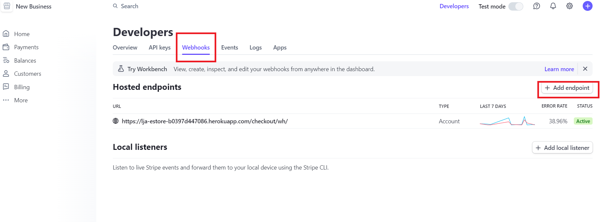

 

6. Create a webhook with the URL of your website, such as https://example.com/checkout/wh/  

See Images

 

7. Choose the events you want to receive, such as payment_intent.payment_failed and payment_intent.succeeded  

See Images

 

8. Take note of the key generated for this webhook  

9. Create an environment variable, such as STRIPE_WH_SECRET, with the value of the webhook secret key on your local environment and Heroku  

10. Test the webhook to ensure it is working properly and troubleshoot any issues that may arise.  

See Images

 

### Heroku  

[Official Page](https://devcenter.heroku.com/articles/git) (Ctrl + click)

This application has been deployed from Github using Heroku. Here's how:

1. Create an account at heroku.com

See Images

2. Create an app, give it a name for such as lja-estore, and select a region

See Images

Heroku

1. The DATABASE_URL, this can be set as an environment variable in Heroku config vars

See Images

2. Install the plugins dj-database-url and psycopg2-binary.

3. Run pip3 freeze > requirements.txt so both are added to the requirements.txt file

See Images

4. Create a Procfile with the text: web: gunicorn the_diplomat.wsgi

See Images

5. In the settings.py ensure the connection is set to the Heroku postgres database

See Images

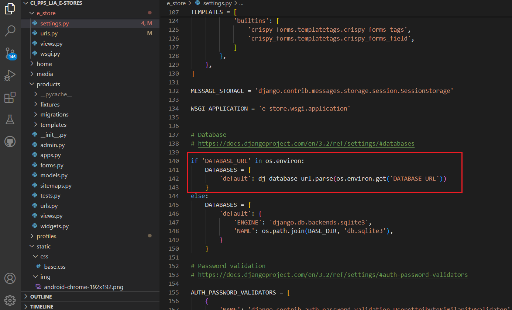

6. Ensure debug is set to false in the settings.py file

See Images

7. Add localhost, and lja-estore-b0397d447086.herokuapp.com to the ALLOWED_HOSTS variable in settings.py

8. Run "python3 manage.py showmigrations" to check the status of the migrations

9. Run "python3 manage.py migrate" to migrate the database

10. Run "python3 manage.py createsuperuser" to create a super/admin user

11. Run "python3 manage.py loaddata categories.json" on the categories file in products/fixtures to create the categories

12. Run "python3 manage.py loaddata products.json" on the products file in products/fixtures to create the products

13. Install gunicorn and add it to the requirements.txt file using the command pip3 freeze > requirements.txt

14. Disable collectstatic in Heroku before any code is pushed using the command heroku config:set DISABLE_COLLECTSTATIC=1 -a lja-estore

15. Ensure the following environment variables are set in Heroku

See Images

16. Connect the app to GitHub, and enable automatic deploys from main if you wish

17. Click deploy to deploy your application to Heroku for the first time

18. Click on the link provided to access the application

19. If you encounter any issues accessing the build logs is a good way to troubleshoot the issue

### Fork Repository
To fork the repository by following these steps:
1. Go to the GitHub repository
2. Click on Fork button in upper right hand corner

### Clone Repository
You can clone the repository by following these steps:
1. Go to the GitHub repository 
2. Locate the Code button above the list of files and click it 
3. Select if you prefere to clone using HTTPS, SSH, or Github CLI and click the copy button to copy the URL to your clipboard
4. Open Git Bash
5. Change the current working directory to the one where you want the cloned directory
6. Type git clone and paste the URL from the clipboard ($ git clone https://github.com/YOUR-USERNAME/YOUR-REPOSITORY)
7.Press Enter to create your local clone.

##### Back to [top](#table-of-contents)

## Credits

### Code  
- Code Institute for the bag and checkout app as a basis for my checkout and bag apps
- Code Institute Slack community for guidance on many of my bug fixes.

### Media
[Pexels](https://www.pexels.com/)

##### Back to [top](#table-of-contents)

## Acknowledgements

### Special thanks to the following:
- My Mentor Mo Shami for his excellent guidance and valuable advice  
- Code Institute Slack Community
- Code Institute Tutor Support